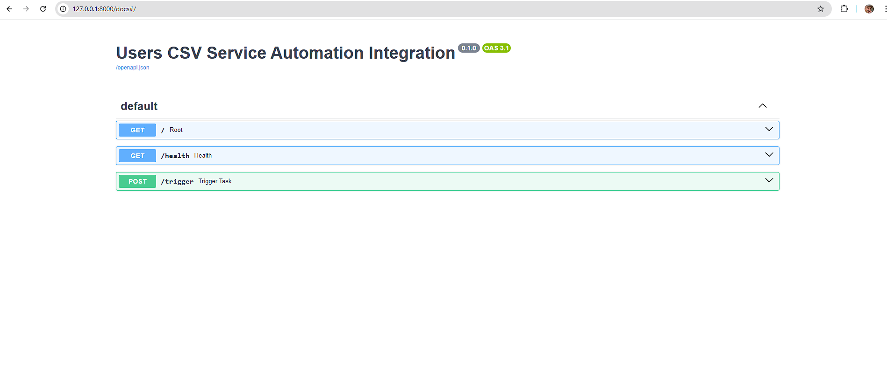
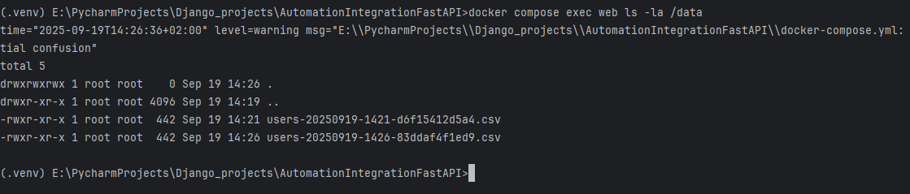
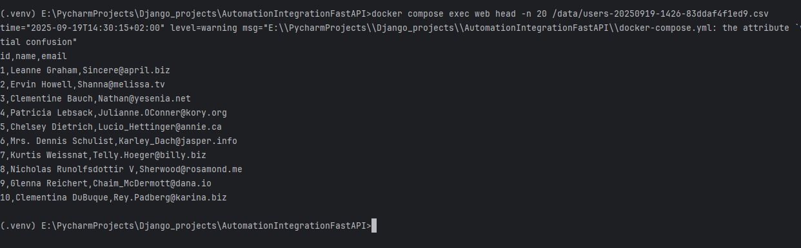
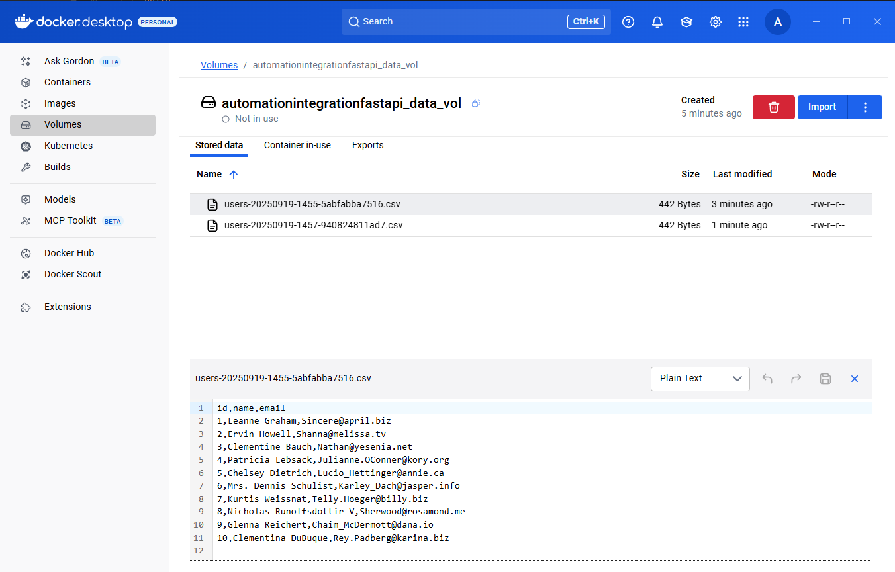

"# Automation-Integration-FastAPI" 

Automation-Integration-FastAPI app.
A small service that periodically fetches users from a public API and 
saves a CSV (`id,name,email`) with a **unique filename**:
`users-YYYYMMDD-HHMM-<uuid>.csv`.  
Scheduling is handled by **Celery Beat**; 
message brokering and result storage are provided by **Redis**.

**Tech:** FastAPI + Uvicorn · Celery (worker + beat) · 
Redis (broker + result backend) · Docker & Docker Compose

> Automatic Swagger documentation is available at **`/docs`**.  
> 

## How it works (high level).
1. `POST /trigger` publishes a Celery task to Redis (the broker).
2. The Celery **worker** consumes the task, fetches users from the external API,
and writes a CSV to `/data` (atomic write).
3. Celery **Beat** periodically enqueues the same task based on `FETCH_EVERY_MINUTES`.
4. Task results/statuses are stored in Redis (result backend) for a limited time.

**Filename format:** `users-YYYYMMDD-HHMM-<uuid>.csv`.  
The UUID is derived from the Celery `task_id` (stable across retries) or 
falls back to a random UUID when needed.

**API endpoints**
- `GET /health` → `{"status":"ok"}`
- `POST /trigger` → `{"task_id":"...","status":"queued"}`


## Installing / Getting started

**Prerequisites**
- Python 3.12+
- Docker & Docker Compose (recommended path)


# Environment configuration

```bash
git clone https://github.com/Anton-Konyk/Automation-Integration-FastAPI
cd Automation-Integration-FastAPI
cp .env.sample .env
````
Fill in the variables as needed. Notes:
TZ — IANA timezone (e.g., Europe/Bratislava).
CELERY_BROKER_URL / CELERY_RESULT_BACKEND — in Docker use redis://redis:6379/...;
CSV_DIR — with Docker it must be /data (mapped to the named volume or bind mount).
FETCH_EVERY_MINUTES — interval in minutes. Common values:
60 = hourly
1440 = daily
5 = every 5 minutes

# Run (Docker)

```bash
docker compose pull
docker compose build --pull
docker compose up -d

curl http://localhost:8000/health
curl -X POST http://localhost:8000/trigger
```


## Logs
docker compose logs -f web
docker compose logs -f worker
docker compose logs -f beat


## Where are the CSV files?

This setup uses a named Docker volume (e.g., data_vol) mounted as /data in the containers.
List files inside the volume:
```bash
docker compose exec web ls -la /data
```
Copy a CSV from the volume to your host (replace filename as needed):
```bash
docker cp task2-web:/data/users-YYYYMMDD-HHMM-xxxxxxxxxxxx.csv .
```

## Demo





## Contributing

Open source project — contributions are welcome!
Please fork the repository and open a pull request from a feature branch.
